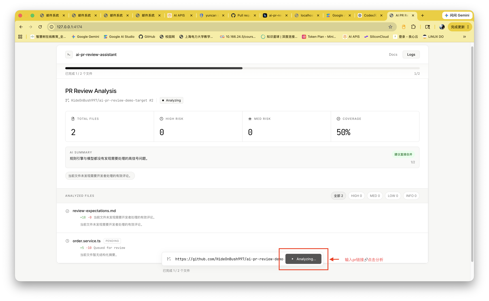
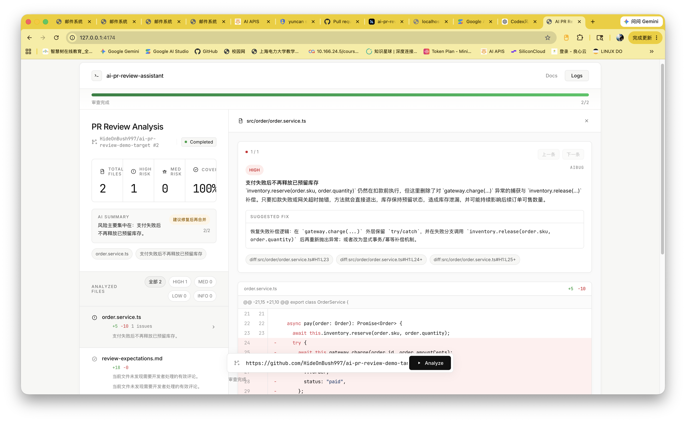
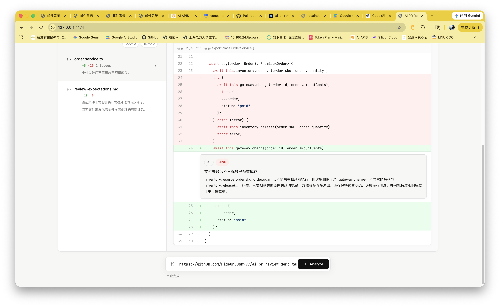
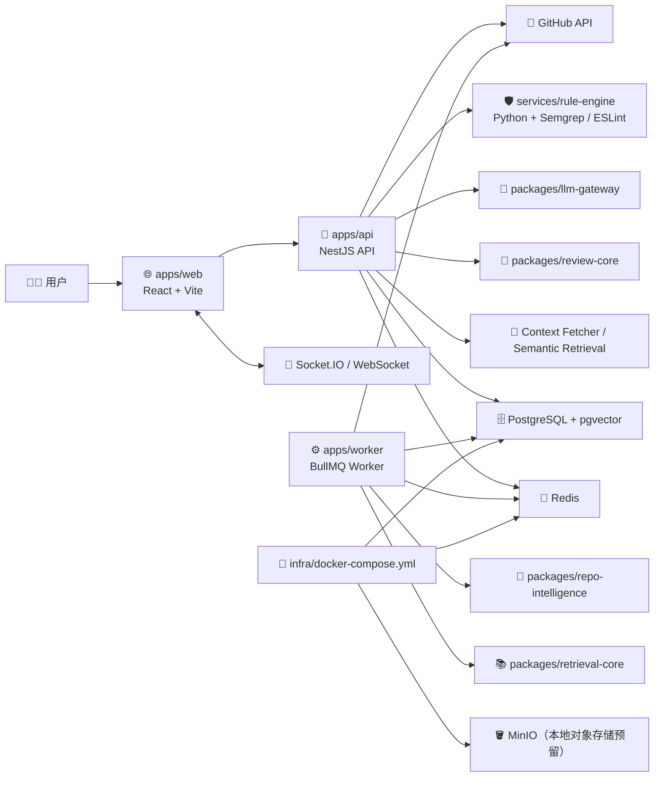
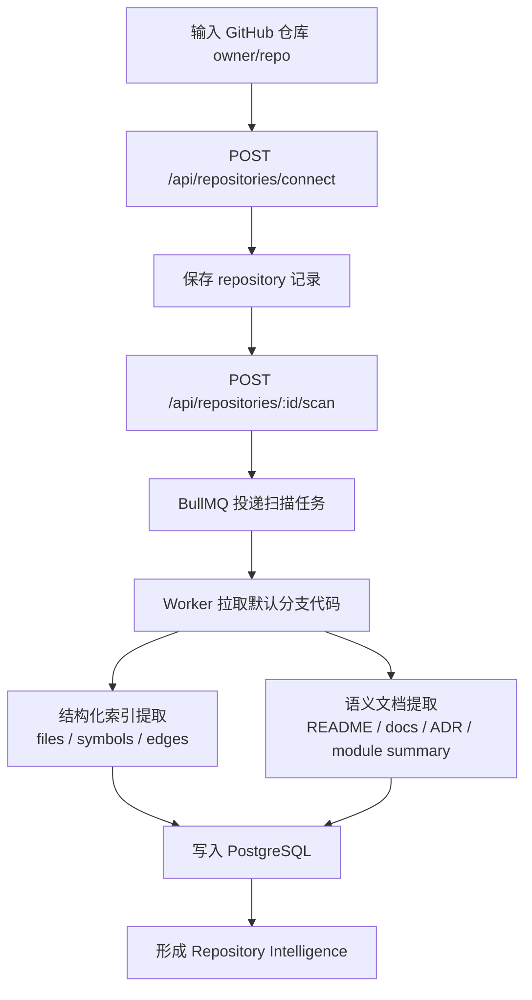
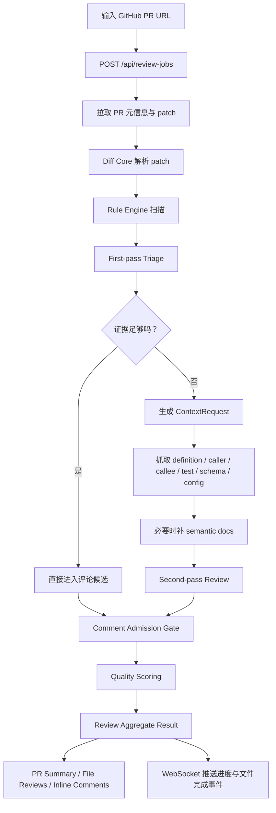
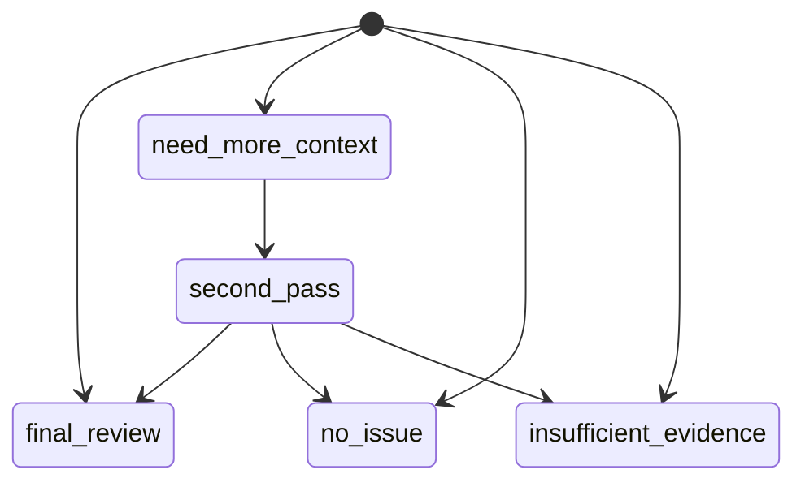

# 🤖 AI PR Review 助手

一个面向 GitHub Pull Request 的 `AI PR Review` 系统。  
它不是简单的“把 diff 扔给大模型”，而是一个围绕 **仓库语义地图、动态上下文检索、评论准入与质量评分** 设计的审查工作台。

> 核心目标：让模型像高级工程师一样，先判断证据是否足够，再按需查定义、调用链、测试、配置和设计文档，最后只输出有证据、可执行、低噪音的评论。

🌐 在线地址：[https://pr.zyzsharehub.cn/](https://pr.zyzsharehub.cn/)

注：当前演示环境连的ChatGPT 5.4 用的中转站日卡 有时不能用可能因为没及时续费

---

## ✨ 项目亮点

- 🧠 **Repository Intelligence**
  接入仓库后自动扫描代码结构，构建文件、符号、调用边、模块摘要、风险标签和语义文档索引。

- 🔍 **Dynamic Context Retrieval**
  首轮审查不盲目下结论；当证据不足时，系统会按需抓取 `definition / caller / callee / test / schema / config / README / ADR` 等上下文。

- 🧪 **Evidence-driven Review**
  审查输出围绕 `diffLineRef`、`evidenceRefs`、故障条件、影响方式和修复建议组织，不鼓励泛泛而谈。

- 🚦 **Quality Gates**
  最终评论需要经过 `Triage -> Context Fetch -> Second-pass -> Admission Gate -> Quality Scoring` 多层约束，降低“废话评论”和误报。

- 🖥️ **Web Review Workspace**
  提供 PR 总览、文件级问题列表、Diff Viewer、评论联动、实时进度和 WebSocket 增量更新。

- 📦 **Contract-first Monorepo**
  全仓库采用 `npm workspace + TypeScript + Zod`，`packages/shared-types` 是 API、Worker、Web、Review Core 的唯一共享契约层。

---

## 🧭 这个项目解决什么问题

传统 AI Code Review 工具通常有 3 个问题：

1. 只看 diff，缺少仓库上下文。
2. 一上来就让模型产最终评论，误报和空话很多。
3. 前后端、队列、规则引擎、模型输出没有统一契约，系统越做越乱。

这个项目的解决思路是：

```text
GitHub PR
  -> Diff 解析
  -> 首轮 Triage
  -> 按需检索上下文
  -> 二轮审查
  -> 评论准入与质量评分
  -> PR Summary / Inline Comments / Merge Suggestion
```

---

## 🖼️ 效果展示

下面这 3 张截图对应的是当前工作台的核心使用视图：

1. 审查进行中总览页：展示 PR 基本信息、进度条、风险统计、摘要和文件列表。



2. 文件问题详情页：左侧看文件级结果，右侧看评论详情、证据和修复建议。



3. Diff Viewer 联动页：直接把评论挂到具体代码位置，支持按文件和问题来回定位。



---

## 🏗️ 当前架构

### 1. 运行拓扑图

> 下图描述的是 **当前仓库已经落地的运行结构**，不是未来设想图。



### 2. 分层说明

| 层         | 目录                                               | 作用                                                       |
| ---------- | -------------------------------------------------- | ---------------------------------------------------------- |
| API 层     | `apps/api`                                         | 仓库接入、PR 审查、查询面、WebSocket 推送、LangSmith trace |
| Worker 层  | `apps/worker`                                      | 仓库扫描任务编排、结构化索引与语义语料写入                 |
| Web 层     | `apps/web`                                         | PR 工作台、文件列表、Diff Viewer、评论联动                 |
| 契约层     | `packages/shared-types`                            | Zod schema + TS types，跨模块 JSON 真源                    |
| 审查核心   | `packages/review-core`                             | triage、context plan、admission、quality、aggregate 纯逻辑 |
| Diff 核心  | `packages/diff-core`                               | patch 解析、hunk 行映射、`diffLineRef`                     |
| 仓库智能   | `packages/repo-intelligence`                       | 文件、符号、调用边、风险标签、摘要提取                     |
| 检索核心   | `packages/retrieval-core`                          | 语义文档切片、检索与 scoring                               |
| Prompt/LLM | `packages/prompt-builder` / `packages/llm-gateway` | prompt 构造、结构化模型调用、LangSmith 集成                |
| 规则引擎   | `services/rule-engine`                             | Semgrep / ESLint 标准化输出                                |

---

## 🔄 核心流程

### 1. 仓库接入与语义地图构建



### 2. PR 审查主流程



### 3. 审查决策状态机



---

## 🧩 核心功能

### ✅ 已完成的核心闭环

- 🐙 **GitHub 仓库接入**
  - 校验仓库存在性与权限
  - 拉取默认分支、clone URL、基础元信息

- 🗺️ **仓库扫描与 Repository Intelligence**
  - 提取 `repository_files`
  - 提取 `symbols`
  - 提取 `symbol_edges`
  - 生成文件摘要、模块摘要、风险标签
  - 构建语义文档与检索数据

- 🧾 **PR 拉取与 Diff Core**
  - 拉取 PR 元信息与变更文件
  - 解析 unified diff patch
  - 建立 `DiffHunk` 和 `diffLineRef`
  - 维护 old/new 行号映射

- 🛡️ **规则引擎接入**
  - 本地 Python sidecar
  - 统一接入 Semgrep / ESLint
  - 输出标准化 `RuleViolation`

- 🧠 **首轮审查与 Triage**
  - 结构化 `ReviewTriageDecision`
  - 判断 `final_review / need_more_context / no_issue / insufficient_evidence`
  - 保留 provisional findings

- 🔎 **上下文检索与二轮审查**
  - 定义 `ContextRequest`
  - 支持检索：
    - symbol definition
    - callers
    - callees
    - related tests
    - schema / migration
    - config / feature flag
    - README / doc / ADR / module summary

- 🚦 **评论准入与结果聚合**
  - `Comment Admission Gate`
  - `Quality Score Breakdown`
  - `PR Summary`
  - `Merge Recommendation`

- 🖥️ **Web 工作台**
  - PR 总览
  - 文件级问题列表
  - Diff Viewer
  - 评论点击联动
  - 顶部分析进度条
  - WebSocket + polling fallback

### 🛠️ 当前增强项 / 后续项

- GitHub Inline Review Comment 回写
- 更细粒度的 diff 分片执行
- 评估数据集与自动回归基线
- 更完整的多语言深度索引

> 当前版本已经完成“仓库接入 -> 扫描 -> PR 审查 -> 上下文检索 -> Web 展示”的核心闭环。  
> `GitHub 回写` 和 `评估数据集` 属于增强项，不影响主链路运行。

---

## 🧪 审查质量机制

这个项目最重要的不是“接了哪个模型”，而是 **怎么约束模型输出质量**。

### 它不是直接评论，而是先做决策

- `final_review`
- `need_more_context`
- `no_issue`
- `insufficient_evidence`

### 它不是直接放行评论，而是先过门禁

- 没有 `diffLineRef`，默认不该进入最终输出
- 没有 `evidenceRefs`，默认要被压制
- 说不清故障条件和影响方式，质量分会很低
- 纯风格建议、重复建议、低行动性建议会被抑制

### 它不是只有结构化索引，也不是只有 RAG

- **结构化索引** 负责“代码真相”
  - 定义
  - 调用方
  - 被调用方
  - 测试
  - schema
  - config

- **语义检索** 负责“背景信息”
  - README
  - docs
  - ADR
  - module summary

---

## 🛠️ 技术栈

### 后端 / 审查链路

| 类别        | 选型                               |
| ----------- | ---------------------------------- |
| API         | NestJS                             |
| Worker      | BullMQ                             |
| 语言        | TypeScript                         |
| 契约        | Zod + inferred TS types            |
| 数据库      | PostgreSQL 16 + pgvector           |
| 队列 / 缓存 | Redis                              |
| LLM 接入    | OpenAI-compatible Chat Completions |
| Trace       | LangSmith                          |
| 规则引擎    | Python + Semgrep + ESLint          |
| Diff 解析   | 自研 `packages/diff-core`          |

### 前端

| 类别 | 选型             |
| ---- | ---------------- |
| UI   | React 19         |
| 构建 | Vite             |
| 通信 | REST + Socket.IO |
| 语言 | TypeScript       |

### 本地基础设施

| 服务                  | 作用             | 默认端口        |
| --------------------- | ---------------- | --------------- |
| PostgreSQL + pgvector | 持久化与向量检索 | `55432`         |
| Redis                 | 队列与状态       | `56379`         |
| MinIO                 | 本地对象存储预留 | `59000 / 59001` |
| rule-engine           | 规则扫描本地进程 | `58001`         |
| API                   | NestJS 服务      | `3001`          |
| Web                   | Vite dev server  | `3000`          |

---

## 📁 仓库结构

```text
ai-pr-review-assistant/
├── apps/
│   ├── api/                     # NestJS API、查询面、审查主链路、WebSocket
│   ├── web/                     # React 工作台
│   └── worker/                  # BullMQ Worker、仓库扫描任务
├── packages/
│   ├── shared-types/            # Zod schema + TS types，跨模块真源
│   ├── review-core/             # triage / admission / quality / aggregate 纯逻辑
│   ├── diff-core/               # diff 解析与 line refs
│   ├── repo-intelligence/       # 结构化索引提取
│   ├── retrieval-core/          # 语义文档切片与检索
│   ├── prompt-builder/          # 一轮/二轮 prompt 构建
│   └── llm-gateway/             # LLM 调用与 LangSmith trace
├── services/
│   └── rule-engine/             # Python 规则引擎 sidecar
├── docs/                        # 架构设计、contracts、开发计划
├── fixtures/                    # Mock 真源
├── infra/
│   ├── docker-compose.yml       # 本地基础设施
│   └── postgres/init.sql        # 数据库真源
└── README.md
```

---

## 🚀 快速开始

> 当前仓库约定是：**基础设施走 Docker Compose，代码服务走本地进程**。

### 1. 准备环境变量

```bash
cp .env.example .env
```

至少需要补这些值：

- `GITHUB_TOKEN`
- `LLM_API_KEY`
- `LANGSMITH_API_KEY`（如果要看 trace）

### 2. 启动基础设施

```bash
docker compose -f infra/docker-compose.yml up -d
```

### 3. 启动 rule-engine

```bash
cd services/rule-engine
python app.py
```

> 说明：
>
> - `rule-engine` 是本地 Python 进程，不通过 Docker Compose 启动
> - 规则引擎会尝试调用本机的 `semgrep` 和 `npx eslint`

### 4. 启动 API

```bash
npm run dev --workspace=@ai-pr-review/api
```

### 5. 启动 Worker

```bash
npm run dev --workspace=@ai-pr-review/worker
```

### 6. 启动 Web

```bash
npm run dev --workspace=@ai-pr-review/web
```

启动后可访问：

- Web: [http://127.0.0.1:3000](http://127.0.0.1:3000)
- API Health: [http://127.0.0.1:3001/api/health](http://127.0.0.1:3001/api/health)

---

## 🧪 常用验证命令

### 全仓检查

```bash
npm run check
npm run build
```

### Web

```bash
npm run check --workspace=@ai-pr-review/web
npm run build --workspace=@ai-pr-review/web
```

### API smoke / validation

```bash
npm run validate:repository-connect --workspace=@ai-pr-review/api
npm run validate:review-aggregation --workspace=@ai-pr-review/api
npm run smoke:repository-connect --workspace=@ai-pr-review/api
npm run smoke:rule-engine --workspace=@ai-pr-review/api
npm run smoke:first-pass-review --workspace=@ai-pr-review/api
npm run smoke:langsmith-trace --workspace=@ai-pr-review/api
```

---

## 📡 主要 API 面

### Repository

- `POST /api/repositories/connect`
- `POST /api/repositories/:repositoryId/scan`
- `GET /api/repositories/:repositoryId/scans/:scanId`
- `GET /api/repositories/:repositoryId/semantic-map`
- `POST /api/repositories/:repositoryId/retrieval/search`

### Review Job

- `POST /api/review-jobs`
- `GET /api/review-jobs/:reviewJobId`
- `GET /api/review-jobs/:reviewJobId/files`
- `GET /api/review-jobs/:reviewJobId/comments`

### Review Tools / Debug

- `POST /api/review-tools/context-plan`
- `POST /api/review-tools/first-pass`
- `POST /api/review-tools/triage`
- `POST /api/review-tools/quality-score`
- `POST /api/review-tools/comment-admission`

### Event

- `review_job_progress`
- `file_review_completed`

---

## 📚 文档导航

- [架构设计文档](./docs/ai-pr-review-architecture.md)
- [Contract 总览](./docs/contracts/contracts-overview.md)
- [数据流说明](./docs/contracts/data-flow.md)
- [数据库结构说明](./docs/contracts/database-schema.md)
- [开发计划](./docs/development-plan.md)
- [执行清单](./docs/development-checklist.md)
- [仓库级开发规范](./AGENTS.md)

---

## 📌 当前实现说明

为了让新读者快速理解，这里明确写出 **当前仓库已经落地** 的几个实现事实：

- ✅ `Repository Scan` 由 `apps/worker + BullMQ` 驱动
- ✅ `PR Review` 主链路当前由 `apps/api` 后台任务执行，并通过 WebSocket 推送前端
- ✅ `shared-types` 是跨模块 JSON 契约唯一真源
- ✅ `review-core` 是纯逻辑层，不直接做 IO
- ✅ `rule-engine` 是本地 Python sidecar，不打进 Docker Compose
- ✅ 本地基础设施统一由 `infra/docker-compose.yml` 管理
- ⚠️ `review_jobs.totalSlices / file_reviews.sliceCount` 字段已经建模，但当前主链路仍以**文件级执行**为主，更细粒度 diff 分片属于后续增强

---

## 🎯 项目关键词

`AI Code Review` · `GitHub PR Review` · `Repository Intelligence` · `Dynamic Context Retrieval` · `Contract-first` · `TypeScript Monorepo` · `LangSmith` · `pgvector` · `Evidence-driven Review`
