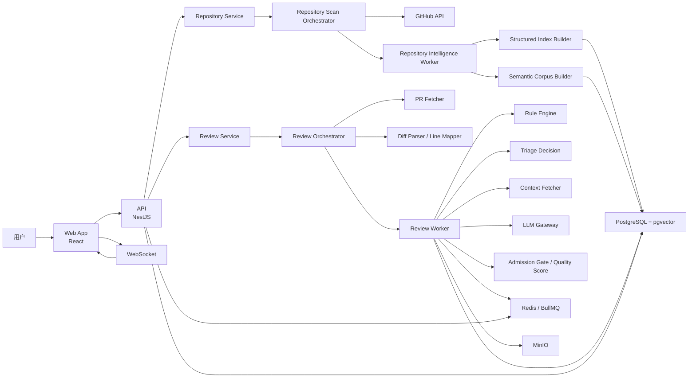
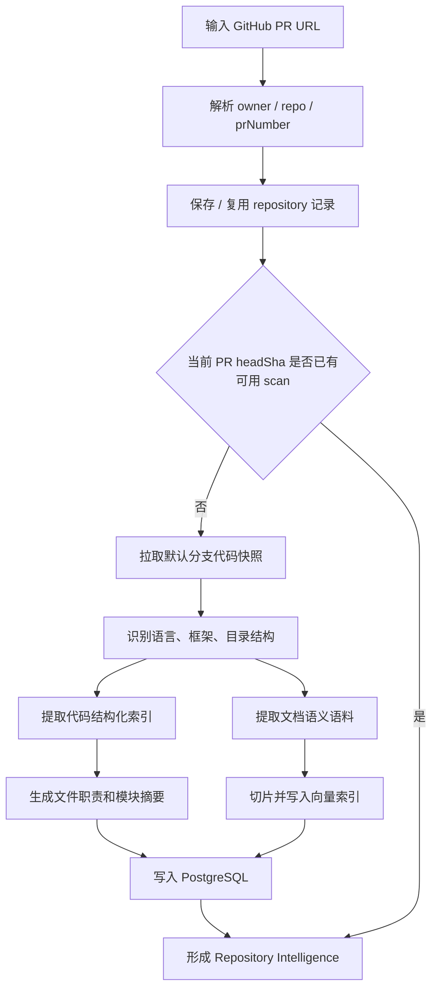
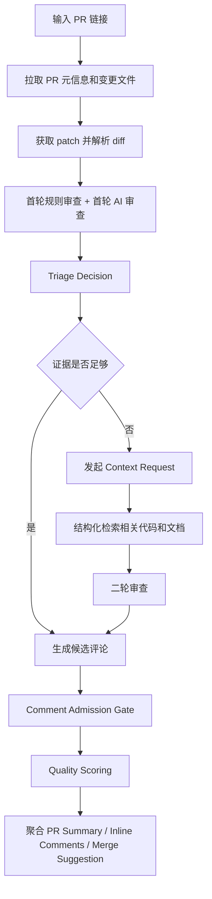
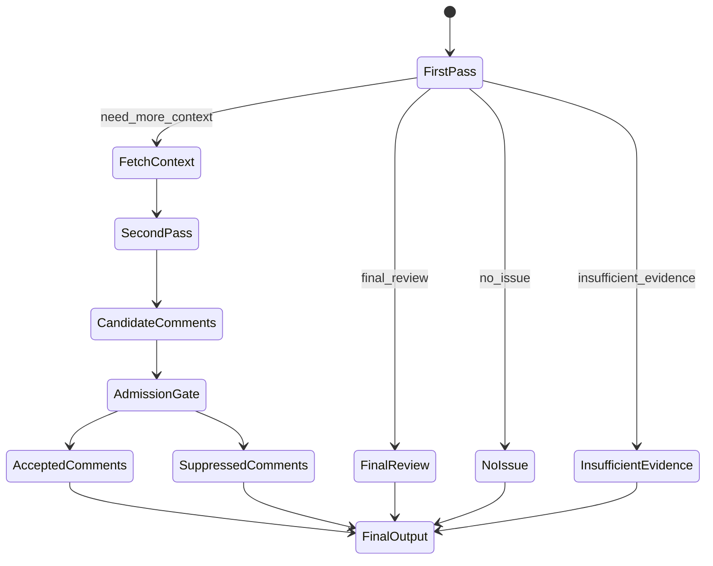

# AI PR Review 助手架构设计文档（V2）

## 1. 文档定位

本文档是 `AI PR Review 助手` 的当前设计真源，目标不是描述一个“会调大模型的 PR 工具”，而是定义一个可落地的 `Repository Intelligence + Dynamic Context Retrieval + Quality Gates` 系统。

本文档重点回答 5 个问题：

1. 用户接入任意 GitHub 仓库后，系统如何自动构建可检索的仓库语义地图。
2. 用户输入 PR 链接后，系统如何做首轮审查、上下文补全、二轮审查和最终结果聚合。
3. 哪些能力可以直接复用现成框架，哪些必须自己实现。
4. API、Worker、前端、数据库和本地基础设施如何分层。
5. 一期应该如何分阶段落地，避免一上来就做成“全功能但不可用”的系统。

范围约束：

- 只覆盖本地开发与联调。
- 基础设施通过 `Docker Compose` 管理，代码服务使用本地进程运行。
- 目标平台为 `GitHub Pull Request Review`。
- 一期优先保证 `TypeScript / JavaScript` 仓库体验最佳。
- 一期允许“任意仓库可接入”，但不承诺所有语言都具备同等深度的语义理解。

## 2. 核心设计结论

### 2.1 系统本质

这个系统不是传统的“Diff + Prompt + LLM 输出评论”。

它的正确形态是：

```text
GitHub Repository
  -> Repository Intelligence
  -> Pull Request First-pass Review
  -> Triage Decision
  -> Dynamic Context Retrieval
  -> Second-pass Review
  -> Comment Admission Gate
  -> Quality Scoring
  -> PR Summary / Inline Comments / Merge Suggestion
```

### 2.2 三个关键判断

1. 代码事实不能依赖向量库猜测，必须来自结构化索引。
2. RAG 只用于补充模块职责、设计意图、README、ADR、接口文档等语义背景。
3. 输出质量的决定因素不是模型是否“会检索”，而是是否有严格的 `Triage -> Context Request -> Admission Gate` 流程。

### 2.3 一期产品原则

- 不做全自动无限制 Agent。
- 不做全仓源码向量化。
- 不做完整 Sourcegraph 替代品。
- 不做泛泛而谈的“建议优化”评论生成器。
- 不做只看 diff 的浅层审查。

## 3. 总体架构

### 3.1 分层架构图



### 3.2 运行主线

系统分两条主线：

- 自动仓库预热主线：围绕 `PR URL` 自动完成仓库接入、scan 检查和必要补扫，构建 `Repository Intelligence`
- PR 审查主线：执行 `Evidence-driven Review`

这两条主线在用户入口上合并为一个 `PR URL` 单入口，在系统内部仍保持解耦。仓库语义地图可以复用，不应该每次 PR 都重扫整仓。

## 4. 仓库接入与 Repository Intelligence

### 4.1 目标

当用户输入一个 GitHub `PR URL` 后，系统先自动识别仓库并补齐仓库知识，再进入后续 PR Review。

也就是说，仓库接入和扫描对用户来说不是单独入口，而是 `PR URL` 驱动的自动前置步骤。

这个语义地图至少要回答：

- 这个仓库有哪些模块。
- 每个文件大致负责什么。
- 每个关键 symbol 定义在哪里。
- 谁调用了谁。
- 哪些文件涉及 `auth / payment / permission / transaction / database / cache / retry / feature flag`。
- 哪些文档可以解释该模块的业务背景和设计意图。

### 4.2 接入流程图



### 4.3 两层知识库，不是一层 RAG

#### 第一层：结构化索引主知识库

这层存“代码真相”，不依赖 embedding。

核心内容：

- `Symbol Index`
- `Import Graph`
- `Call Graph`
- `File Summary`
- `Module Summary`
- `Risk Tags`
- `Test Links`
- `Schema / Migration / Config Links`

典型记录：

```json
{
  "symbol": "verifyToken",
  "filePath": "src/auth/jwt.ts",
  "kind": "function",
  "moduleName": "auth",
  "callers": ["authMiddleware", "refreshSession"],
  "callees": ["decodeJwt", "loadUserPolicy"],
  "tests": ["src/auth/jwt.spec.ts"],
  "riskTags": ["auth"]
}
```

#### 第二层：语义语料辅助库

这层才做 chunk 和 embedding。

只存适合语义检索的内容：

- `README.md`
- `docs/**/*.md`
- ADR / Architecture Notes
- API 设计文档
- 配置说明
- 文件摘要
- 模块摘要
- 规则说明

不把整个源码原文直接塞进向量库。源码全文 embedding 会导致召回噪音很高。

### 4.4 仓库扫描分阶段实现

#### P0：一期可用实现

目标：

- 支持任意 GitHub 仓库接入。
- 对 `TS / JS` 仓库给出高质量结构化索引。
- 对其他语言至少给出目录级、文件级、文档级语义地图。

实现方式：

- GitHub 拉取：只抓默认分支代码快照。
- 技术栈识别：根据 `package.json`、`pyproject.toml`、`go.mod`、`pom.xml` 等规则识别。
- TS/JS 结构化解析：优先使用 `ts-morph` 或 TypeScript Compiler API。
- 多语言兜底解析：使用 `tree-sitter` 做统一语法树解析和基础 symbol 提取。
- 文档抽取：扫描 `README`、`docs`、`adr`、`openapi`、`schema`、`config`。

#### P1：增强实现

- 增加 `Python / Go` 深度提取器。
- 增加跨文件符号引用解析。
- 增加测试用例与被测 symbol 的自动关联。
- 增加风险模块自动标注。

#### P2：高级实现

- 增加增量索引刷新。
- 增加跨 commit 语义地图版本化。
- 增加历史 review pattern 检索。

### 4.5 哪些直接复用，哪些必须自己写

| 能力                 | 可以直接用                           | 结论     | 自研边界                              |
| -------------------- | ------------------------------------ | -------- | ------------------------------------- |
| GitHub 仓库接入      | `Octokit`、GitHub REST / GraphQL API | 直接用   | 接入任务编排、重试、分页、缓存自己写  |
| TS/JS AST 解析       | `ts-morph`                           | 直接用   | symbol 归一化、调用边、测试关联自己写 |
| 多语言统一解析       | `tree-sitter`                        | 直接用   | 不同语言的语义抽取规则自己写          |
| 结构化搜索辅助       | `ast-grep`                           | 可选     | 可作为补充检索，不作为主存储          |
| 文档切片与 embedding | 现成 embedding API + 自己分块        | 半直接用 | 分块策略、元数据、重建逻辑自己写      |
| 向量存储             | `pgvector`                           | 直接用   | 检索排序、过滤、召回策略自己写        |
| 风险标签             | 无现成通用方案                       | 自己写   | 先规则化，后续再引入模型辅助          |

### 4.6 不建议采用的方案

以下方案听起来省事，实际会拖垮质量：

- 整仓源码全部做 embedding。
- 直接把仓库丢给大模型做一次全量总结。
- 一期就做 Neo4j 或完整图数据库。
- 一期就做 IDE 级别 LSP / 索引平台。
- 直接接入大型现成代码智能平台并深度绑定其内部索引格式。

原因很简单：一期真正需要的是“可控、可解释、能服务 PR Review 的仓库事实层”，不是通用代码搜索引擎。

## 5. PR 审查主流程

### 5.1 核心目标

给定一个 PR 链接，系统输出：

- PR 总结
- 风险摘要
- 文件级审查结果
- Inline Review 评论
- 最终合并建议

但系统不能在首轮就直接下最终结论。必须先判断当前证据是否足够。

### 5.2 流程图



### 5.3 GitHub 数据拉取策略

#### 推荐做法

- `GraphQL`：拉 PR 元信息、作者、分支、状态、文件列表、总文件数等。
- `REST Pull Request Files API`：拉每个变更文件的 `patch`、`filename`、`status`、`additions`、`deletions`。

原因：

- GraphQL 适合一次取 PR 聚合元数据。
- 文件 patch 在 REST 层拿更直接，返回结构也更适合 diff 解析。

#### 不建议做法

- 只用 GraphQL 处理所有细节。
- 每个文件单独再去克隆对比一次 Git。

### 5.4 Diff 解析与稳定行锚点

#### 必须解决的问题

LLM 看到的是 diff 文本，不是文件真实行号。如果不做稳定映射，AI 输出的行号会漂。

#### 设计方案

1. 解析 patch 为 `DiffHunk[]`。
2. 为每一行新增稳定引用，如 `L101+`、`L88-`。
3. 建立映射：
   - `diff_line_ref -> new_line_number`
   - `diff_line_ref -> old_line_number`
   - `diff_line_ref -> hunk_id`
4. Prompt 要求模型引用 `diff_line_ref`，而不是裸数字行号。

#### 结论

- Patch 解析可以用轻量库辅助。
- 行号映射和 `diff_line_ref` 规范必须自研。

这是整套系统里最不能偷懒的基础设施之一。

## 6. Review Triage 与二轮上下文检索

### 6.1 为什么要先 Triage

如果没有 `Triage`，模型很容易出现两种坏结果：

- 明明证据不足，却强行给评论。
- 明明只需补查一个调用方，却把上下文无限放大。

所以首轮输出不能是“最终评论”，而应该是 `ReviewTriageDecision`。

### 6.2 Triage 决策类型

一期固定为 4 种：

- `final_review`：证据足够，可以直接出最终评论或空结果。
- `need_more_context`：存在高价值问题，但当前证据不够，需要补充仓库上下文。
- `no_issue`：证据足够且没有发现值得评论的问题。
- `insufficient_evidence`：证据明显不足，且不值得继续扩上下文。

### 6.3 当前契约

当前代码骨架已经落了这批共享契约，位于 `packages/shared-types`：

- `ReviewTriageDecision`
- `ContextRequest`
- `ContextBudget`
- `ContextFetchResult`
- `CommentAdmissionDecision`
- `QualityScoreBreakdown`

示例：

```json
{
  "decision": "need_more_context",
  "confidence": 0.61,
  "riskLevel": "high",
  "rationale": "返回值语义变化可能影响调用方分支逻辑",
  "evidenceCoverage": {
    "modifiedSymbol": true,
    "localContext": true,
    "callers": false,
    "callees": false,
    "tests": false,
    "schema": false
  },
  "contextRequest": {
    "reason": "需要确认调用方是否仍按旧语义消费返回值",
    "symbols": ["AuthService.refreshToken"],
    "callersOf": ["AuthService.refreshToken"],
    "tests": ["AuthService.refreshToken"]
  }
}
```

### 6.4 什么时候允许进入二轮检索

不是所有 PR 都要走二轮。

推荐触发条件：

- 涉及 `auth / payment / permission / transaction / cache / retry / schema`。
- 首轮发现参数、返回值、异常语义发生变化。
- 首轮发现高风险规则命中，但缺少调用链或测试证据。
- 首轮已经怀疑存在真实 bug，但影响范围未知。
- 首轮评论置信度不足，但潜在影响较大。

### 6.5 Context Request 能请求什么

一期不开放任意工具调用，只开放受控检索动作：

- `find_symbol_definition`
- `find_callers`
- `find_callees`
- `read_file_snippet`
- `find_related_tests`
- `find_schema_or_migration`
- `read_config_or_feature_flag`

这也是当前 `packages/review-core` 中 `createContextFetchPlan` 的逻辑基础。

### 6.6 上下文预算

二轮检索必须有预算，不然系统会无限膨胀：

- `maxRounds`
- `maxToolCalls`
- `maxExtraFiles`
- `maxCallDepth`
- `maxExtraTokens`

预算超限时，系统应当返回：

- 不继续扩上下文
- 明确记录原因
- 将结果标记为 `reject_due_to_budget` 或 `insufficient_evidence`

### 6.7 二轮审查状态机



## 7. Comment Admission Gate 与 Quality Scoring

### 7.1 为什么这一步比“会检索”更重要

真正决定系统是否有价值的，不是它能不能多查几个文件，而是它最后发出来的评论是否：

- 有代码锚点
- 有证据链
- 说明了故障条件和影响
- 对开发者可执行
- 不是低信号废话

### 7.2 默认准入规则

一期准入门禁建议如下：

- 没有 `diff_line_ref`，不准发。
- 没有 `evidence_refs`，不准发。
- 没说明“在什么条件下会出问题”，不准发。
- 没有行动建议且不具备明确风险描述，默认压制。
- 分数低于阈值，压制。

### 7.3 质量评分维度

当前 `packages/review-core` 已经实现了基础 `QualityScoreBreakdown`，后续应按这几个维度稳定化：

- `evidenceStrength`
- `impactClarity`
- `actionability`
- `specificity`
- `novelty`
- `noisePenalty`

默认目标：

- 高风险问题应高召回。
- 风格类、低信号、模板化问题应强压制。

### 7.4 典型低信号模式

以下内容默认应该降分：

- “可以考虑优化”
- “建议增强可读性”
- “潜在风险”
- “最好补一下日志”
- “建议增加校验”

这类表达不一定错，但通常对 PR 作者没有足够行动价值。

## 8. 模块设计与实现边界

### 8.1 当前代码骨架状态

| 模块         | 路径                    | 状态     | 说明                                            |
| ------------ | ----------------------- | -------- | ----------------------------------------------- |
| API          | `apps/api`              | 已初始化 | NestJS 应用，已接入调试端点                     |
| Worker       | `apps/worker`           | 已初始化 | 已有最小 review pipeline                        |
| Web          | `apps/web`              | 已初始化 | React + Vite 骨架                               |
| Shared Types | `packages/shared-types` | 已初始化 | Zod Schema 与跨进程契约                         |
| Review Core  | `packages/review-core`  | 已初始化 | Triage、Context Plan、Admission、Quality 纯逻辑 |
| Rule Engine  | `services/rule-engine`  | 已初始化 | Python sidecar 骨架                             |

### 8.2 计划模块边界

| 模块                         | 直接用现成方案                           | 需要自己写                         |
| ---------------------------- | ---------------------------------------- | ---------------------------------- |
| `apps/api`                   | NestJS 控制器、DI、模块、HTTP、WebSocket | 业务聚合、任务状态、权限和错误语义 |
| `apps/worker`                | BullMQ Worker、重试、并发控制            | 审查状态机、上下文预算、结果聚合   |
| `packages/shared-types`      | Zod                                      | 业务 Schema 定义                   |
| `packages/review-core`       | 无                                       | 这是核心自研逻辑                   |
| `packages/repo-intelligence` | Tree-sitter / ts-morph                   | 扫描编排、索引格式、摘要策略       |
| `packages/diff-core`         | 轻量 diff parser                         | 稳定行锚点、hunk 映射、文件切片    |
| `services/rule-engine`       | Semgrep、ESLint                          | 规则结果标准化、仓库级规则加载     |

### 8.3 哪些不要自己造轮子

明确不要自研：

- HTTP 服务框架
- 队列系统
- 向量数据库
- 对象存储
- Diff Viewer
- 静态规则执行器
- Schema 校验库

明确必须自研：

- 仓库语义地图格式
- Diff 行锚点规范
- 上下文请求与预算系统
- 二轮审查编排
- 评论准入门禁
- 质量评分策略
- 结果聚合与去重

## 9. 技术选型与推荐方案

### 9.1 后端与基础设施

| 领域            | 候选                      | 结论            | 原因                                   |
| --------------- | ------------------------- | --------------- | -------------------------------------- |
| API 框架        | NestJS / Fastify 原生     | `NestJS`        | 模块化、DI、队列、WebSocket 集成清晰   |
| 队列            | BullMQ / RabbitMQ / Kafka | `BullMQ`        | 本地开发简单，足够支撑文件级并发与重试 |
| 主数据库        | PostgreSQL / MySQL        | `PostgreSQL`    | JSONB、关系查询、后续向量扩展方便      |
| 向量检索        | pgvector / 独立向量库     | `pgvector`      | 一期不需要独立向量基础设施             |
| 缓存 / 队列存储 | Redis                     | `Redis`         | BullMQ 依赖，状态广播也可复用          |
| 对象存储        | MinIO                     | `MinIO`         | 本地兼容 S3，适合存原始响应和快照      |
| 可观测性        | OpenTelemetry             | `OpenTelemetry` | 统一 trace 和后续接 APM                |

### 9.2 代码理解与检索

| 领域           | 候选          | 结论     | 原因                                       |
| -------------- | ------------- | -------- | ------------------------------------------ |
| TS/JS 语义提取 | `ts-morph`    | 优先     | 直接封装 TypeScript Compiler API，适合一期 |
| 多语言基础解析 | `tree-sitter` | 必备     | 可做统一 AST 底座                          |
| 结构化搜索     | `ast-grep`    | 可选增强 | 适合补充符号级/模式级搜索                  |
| 规则引擎       | `Semgrep`     | 必备     | 多语言、规则 YAML、适合快速上线            |
| TS 规则补充    | `ESLint API`  | 可选     | 前端/Node 仓库可补语言生态规则             |

### 9.3 前端

| 领域      | 结论                     | 原因                         |
| --------- | ------------------------ | ---------------------------- |
| UI 框架   | React + TypeScript       | 和共享契约、状态管理配合自然 |
| 构建工具  | Vite                     | 本地开发快                   |
| 状态管理  | Zustand + TanStack Query | 本地状态和服务端状态职责分明 |
| Diff 渲染 | diff2html                | 没必要自研 diff 视图         |
| 实时通道  | Socket.IO Client         | 和 Nest 网关结合方便         |

## 10. 数据模型设计

新的数据模型要分成两类：

- 仓库级 Intelligence 表
- PR 审查级 Runtime 表

### 10.1 仓库级表

#### `repositories`

记录接入的 GitHub 仓库。

| 字段           | 类型         | 说明              |
| -------------- | ------------ | ----------------- |
| id             | uuid pk      | 主键              |
| provider       | varchar(32)  | 当前固定 `github` |
| owner          | varchar(255) | 仓库 owner        |
| repo           | varchar(255) | 仓库名            |
| default_branch | varchar(255) | 默认分支          |
| clone_url      | text         | clone 地址        |
| is_active      | boolean      | 是否启用          |
| created_at     | timestamptz  | 创建时间          |
| updated_at     | timestamptz  | 更新时间          |

#### `repository_scans`

记录每次仓库扫描任务。

| 字段              | 类型        | 说明                                      |
| ----------------- | ----------- | ----------------------------------------- |
| id                | uuid pk     | 主键                                      |
| repository_id     | uuid fk     | 所属仓库                                  |
| scan_type         | varchar(32) | `full` / `incremental`                    |
| target_sha        | varchar(64) | 扫描目标 commit                           |
| status            | varchar(32) | `pending` / `running` / `done` / `failed` |
| language_summary  | jsonb       | 语言统计                                  |
| framework_summary | jsonb       | 框架识别结果                              |
| started_at        | timestamptz | 开始时间                                  |
| finished_at       | timestamptz | 完成时间                                  |

#### `repository_files`

记录文件元信息与职责摘要。

| 字段          | 类型         | 说明                                            |
| ------------- | ------------ | ----------------------------------------------- |
| id            | uuid pk      | 主键                                            |
| repository_id | uuid fk      | 所属仓库                                        |
| scan_id       | uuid fk      | 所属扫描                                        |
| file_path     | text         | 文件路径                                        |
| language      | varchar(64)  | 语言                                            |
| kind          | varchar(32)  | `source` / `test` / `doc` / `config` / `schema` |
| module_name   | varchar(255) | 所属模块                                        |
| summary       | text         | 文件职责摘要                                    |
| risk_tags     | jsonb        | 风险标签数组                                    |
| checksum      | varchar(64)  | 文件摘要                                        |

#### `symbols`

核心 symbol 索引。

| 字段           | 类型         | 说明                                               |
| -------------- | ------------ | -------------------------------------------------- |
| id             | uuid pk      | 主键                                               |
| repository_id  | uuid fk      | 所属仓库                                           |
| scan_id        | uuid fk      | 所属扫描                                           |
| file_id        | uuid fk      | 所属文件                                           |
| symbol_name    | text         | 名称                                               |
| qualified_name | text         | 全限定名                                           |
| kind           | varchar(32)  | `function` / `class` / `method` / `type` / `route` |
| start_line     | int          | 起始行                                             |
| end_line       | int          | 结束行                                             |
| signature      | text         | 签名摘要                                           |
| module_name    | varchar(255) | 所属模块                                           |
| risk_tags      | jsonb        | 风险标签                                           |

#### `symbol_edges`

记录符号关系图。

| 字段           | 类型        | 说明                                                     |
| -------------- | ----------- | -------------------------------------------------------- |
| id             | uuid pk     | 主键                                                     |
| repository_id  | uuid fk     | 所属仓库                                                 |
| scan_id        | uuid fk     | 所属扫描                                                 |
| from_symbol_id | uuid fk     | 起点                                                     |
| to_symbol_id   | uuid fk     | 终点                                                     |
| edge_type      | varchar(32) | `imports` / `calls` / `tests` / `defines` / `references` |

#### `semantic_documents`

向量语义语料。

| 字段          | 类型        | 说明                                            |
| ------------- | ----------- | ----------------------------------------------- |
| id            | uuid pk     | 主键                                            |
| repository_id | uuid fk     | 所属仓库                                        |
| scan_id       | uuid fk     | 所属扫描                                        |
| source_path   | text        | 来源文件                                        |
| document_type | varchar(32) | `readme` / `doc` / `module_summary` / `api_doc` |
| chunk_index   | int         | 分块编号                                        |
| content       | text        | chunk 内容                                      |
| metadata      | jsonb       | 模块、标签、标题等                              |
| embedding     | vector      | 向量                                            |

### 10.2 PR 审查级表

#### `pull_requests`

PR 元信息。

#### `review_jobs`

一次完整审查任务。

#### `file_reviews`

文件聚合级结果。

#### `review_comments`

最终评论。

#### `llm_call_logs`

模型调用日志与原始响应元信息。

#### `context_fetch_logs`

二轮检索记录。

这些表的一期字段设计可沿用当前旧文档中的基础字段，但必须额外补上：

- `triage_decision`
- `context_round`
- `evidence_refs`
- `quality_score`
- `admission_reasons`
- `duplicate_fingerprint`

## 11. 接口契约设计

### 11.1 对外 API

#### 仓库接入

- `POST /api/repositories/connect`
- `POST /api/repositories/:id/scan`
- `GET /api/repositories/:id`
- `GET /api/repositories/:id/semantic-map`

#### PR 审查

- `POST /api/review-jobs`
- `GET /api/review-jobs/:id`
- `GET /api/review-jobs/:id/files`
- `GET /api/review-jobs/:id/comments`
- `POST /api/review-jobs/:id/writeback`

### 11.2 WebSocket 事件

- `review_job_started`
- `file_review_started`
- `file_review_complete`
- `review_job_progress`
- `review_job_done`
- `review_job_failed`

### 11.3 当前已实现的调试接口

当前 `apps/api` 已存在一组调试端点，适合先验证质量门禁逻辑：

- `POST /review-tools/context-plan`
- `POST /review-tools/triage`
- `POST /review-tools/quality-score`
- `POST /review-tools/comment-admission`

这组接口不是最终产品 API，但可以作为 `review-core` 的验收入口。

## 12. 前端设计

### 12.1 页面分区

一期建议 3 个核心页面：

1. `PR URL` 审查入口页
2. PR 审查工作台
3. 仓库语义地图页

### 12.2 PR 审查工作台布局

- 左侧：文件列表与风险等级
- 中间：Diff Viewer
- 右侧：评论面板、PR Summary、Merge Suggestion
- 顶部：整体进度条、轮次、缓存命中、成本和耗时

### 12.3 核心交互

- 点击文件，切换 active diff
- 点击评论，滚动到对应 `diff_line_ref`
- 点击“为什么判定为问题”，展开 evidence chain
- 点击“查看补充上下文”，展开调用链 / 定义 / 测试 / 文档摘要

### 12.4 状态模型

建议前端 store 保持 4 组核心状态：

- `repositoryState`
- `reviewJobState`
- `diffViewerState`
- `commentPanelState`

其中：

- `Zustand` 管理本地交互状态
- `TanStack Query` 管理服务端数据缓存

## 13. 本地开发与 Docker Compose

### 13.1 当前本地基础设施

当前 `infra/docker-compose.yml` 已确定如下服务：

- `postgres`：`pgvector/pgvector:pg16`，宿主机端口 `55432`
- `redis`：`redis:7-alpine`，宿主机端口 `56379`
- `minio`：`minio/minio`，宿主机端口 `59000/59001`
- `rule-engine`：本地 Python 进程，监听 `58001`，不进入 Docker Compose

### 13.2 建议的本地运行职责

| 服务        | 用途                           |
| ----------- | ------------------------------ |
| PostgreSQL  | 主数据存储 + 向量存储          |
| Redis       | BullMQ 队列与状态              |
| MinIO       | 原始响应、patch 快照、审计归档 |
| Rule Engine | Semgrep / ESLint 的包装运行层  |

### 13.3 为什么本地不再加更多服务

一期不要引入：

- Kafka
- Elasticsearch
- Neo4j
- 独立向量数据库
- 分布式任务系统

理由不是这些技术不好，而是当前目标是先做出“准、稳、可验证”的 PR Review 核心链路。

## 14. 实现路线图

### 14.1 Phase 1：Repository Intelligence 打底

交付物：

- 仓库接入 API
- 默认分支扫描任务
- `repository_files`、`symbols`、`symbol_edges`、`semantic_documents`
- TS/JS 深度解析 + 多语言兜底解析
- 仓库语义地图查询接口

验收标准：

- 能接入一个 GitHub 仓库并完成扫描。
- 能查某个 symbol 的定义、调用方、模块和测试。
- 能检索 README / docs / module summary。

### 14.2 Phase 2：PR Review 主链路

交付物：

- PR 拉取
- Diff 解析与 `diff_line_ref`
- 首轮规则审查
- 首轮 AI 审查
- `TriageDecision`
- `ContextRequest`
- 二轮检索与二轮审查

验收标准：

- 给定一个 PR，系统能完成首轮和按需二轮审查。
- 上下文请求受预算控制。
- 能输出结构化候选评论。

### 14.3 Phase 3：质量门禁与前端工作台

交付物：

- `Comment Admission Gate`
- `Quality Scoring`
- PR Summary 聚合
- Diff Viewer 联动
- WebSocket 增量更新

验收标准：

- 低信号评论被显著压制。
- 高风险评论能附带证据链。
- 前端可查看文件、评论、上下文和最终建议。

### 14.4 Phase 4：GitHub 回写与缓存

交付物：

- GitHub inline review comment 回写
- 基于 `head_sha + patch_hash` 的缓存
- 历史 review pattern 检索

验收标准：

- 相同 PR 重跑能复用未变化文件的结果。
- 用户可将高质量评论写回 GitHub。

## 15. 关键风险与控制策略

### 15.1 风险：任意语言支持过度承诺

控制：

- 产品层说“任意仓库可接入”。
- 工程层明确“一期高质量支持 TS/JS，其他语言先做基础能力”。

### 15.2 风险：调用图不完整

控制：

- 静态调用图允许“不完整但可解释”。
- 对动态语言或反射场景，不强行输出高置信评论。
- 用 `insufficient_evidence` 保持诚实。

### 15.3 风险：上下文失控

控制：

- 强制 `ContextBudget`
- 强制工具白名单
- 强制二轮上限

### 15.4 风险：评论质量滑坡

控制：

- Admission Gate
- Quality Score
- 低信号短语惩罚
- 去重指纹

## 16. 当前代码与文档对齐结论

截至当前仓库状态，下面这些能力已经有真实骨架，不是纸面设计：

- `packages/shared-types`
  - 已有 `ReviewTriageDecision`、`ContextRequest`、`ContextBudget`、`CommentAdmissionDecision`、`QualityScoreBreakdown`
- `packages/review-core`
  - 已有 `createContextFetchPlan`
  - 已有 `evaluateReviewTriage`
  - 已有 `evaluateCommentAdmission`
  - 已有 `scoreCommentCandidate`
- `apps/api`
  - 已有对应调试控制器与 service 包装层
- `apps/worker`
  - 已有最小可执行 review pipeline 示例

因此，这份文档不是“从零想象”，而是基于当前骨架往完整系统推进的设计规格。

## 17. 最终结论

这个项目的成败，不在于它是不是“用了 RAG”，也不在于它是不是“给了 LLM tool use”。

真正的关键是：

1. 是否先建对了 `Repository Intelligence`。
2. 是否把代码事实和语义背景分层。
3. 是否让模型先做 `Triage`，再决定要不要检索。
4. 是否用 `Admission Gate + Quality Scoring` 把废话压掉。

正确的系统定位应该是：

`一个以仓库语义地图为底座、以证据为中心、按需动态检索上下文的 AI PR Review 系统。`
