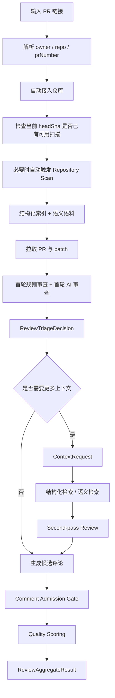
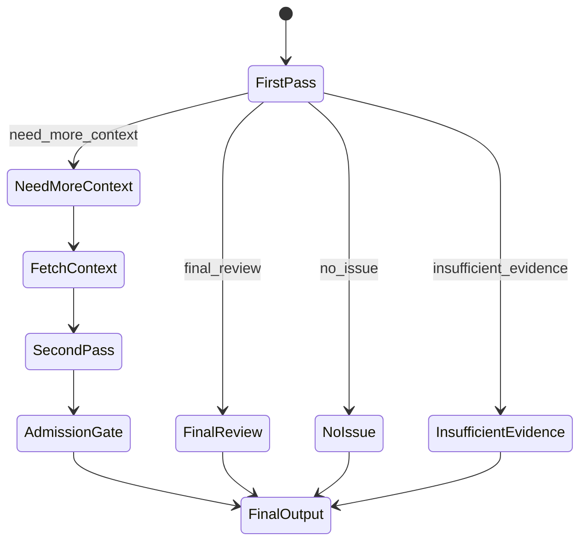

# 数据流与状态机

## 1. 主数据流

## 2. 数据流输入输出

### 阶段 1：PR URL 解析与自动仓库接入

输入：

- `PullRequestUrl`

输出：

- `PullRequestRef`
- `RepositoryConnectResponse`
- `ApiErrorResponse`

### 阶段 2：仓库扫描预热

输入：

- `RepositoryScanRequest`
- `targetSha`

输出：

- `RepositoryScan`
- `RepositoryFile[]`
- `Symbol[]`
- `SymbolEdge[]`
- `SemanticDocument[]`

### 阶段 3：PR 拉取

输入：

- `CreateReviewJobRequest`

输出：

- `PullRequest`
- `DiffParseResult[]`
- `ReviewJob`

### 阶段 4：首轮审查

输入：

- `PullRequestFile`
- `DiffParseResult`
- 结构化索引片段
- 规则扫描结果

输出：

- `ReviewTriageDecision`

### 阶段 5：二轮上下文检索

输入：

- `ContextRequest`
- `ContextBudget`

输出：

- `ContextFetchResult`

### 阶段 6：评论质量门禁

输入：

- `ReviewCommentCandidate`

输出：

- `CommentAdmissionDecision`
- `QualityScoreBreakdown`

### 阶段 7：最终聚合

输入：

- `ReviewJob`
- `FileReview[]`
- `ReviewComment[]`

输出：

- `ReviewAggregateResult`

## 3. Triage 状态机

## 4. 实时事件流

### 仓库扫描

- `repository_scan_started`
- `repository_scan_completed`
- `repository_scan_failed`

### PR 审查

- `review_job_started`
- `review_job_progress`
- `file_review_started`
- `file_review_completed`
- `review_job_completed`
- `review_job_failed`

## 5. 上下文检索边界

结构化检索优先：

- symbol 定义
- callers
- callees
- 测试
- schema / migration
- config / feature flag

语义检索补充：

- README
- docs
- module summary
- architecture notes

约束：

- 二轮检索必须受 `ContextBudget` 控制
- 不允许无限制自由工具调用
