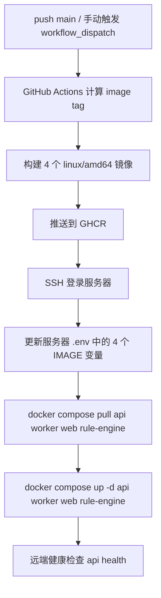

# 镜像构建与服务器部署

本文档描述当前仓库的生产部署方式。  
目标很明确：

1. GitHub Actions 负责构建并推送镜像到 GHCR。
2. 服务器只保存 `docker-compose.yml`、`.env` 和持久化数据。
3. 服务器不拉源码、不在服务器上构建。
4. 只有 `main` 分支允许真正执行构建与部署。

## 1. 部署总流程



## 2. 为什么这次能修复 GHCR 推送问题

之前失败的根因不是 Dockerfile，而是本地 `gh auth token` 缺少 `write:packages`。

当前方案改成由 GitHub Actions 推送 GHCR：

- workflow 显式声明 `permissions.packages=write`
- 通过 `docker/login-action` 使用 `${{ secrets.GITHUB_TOKEN }}` 登录 GHCR
- 给镜像写入 `org.opencontainers.image.source`，让 GHCR 包与当前仓库正确关联

这条链路不依赖本地开发机的 `gh` token scope。

## 3. 镜像命名规则

工作流会为每个服务推送两个 tag：

- `sha-<12位提交SHA>`：本次发布的精确版本
- `latest`：最新主分支版本

当前 4 个镜像：

- `ghcr.io/<owner>/ai-pr-review-api:<tag>`
- `ghcr.io/<owner>/ai-pr-review-worker:<tag>`
- `ghcr.io/<owner>/ai-pr-review-web:<tag>`
- `ghcr.io/<owner>/ai-pr-review-rule-engine:<tag>`

服务器实际部署时会把 `.env` 切到 `sha-<12位提交SHA>`，避免 `latest` 漂移导致回溯困难。

## 4. GitHub Secrets

工作流依赖以下仓库 Secrets：

| Secret 名称           | 用途                                                   |
| --------------------- | ------------------------------------------------------ |
| `SERVER_HOST`         | 服务器地址                                             |
| `SERVER_PORT`         | SSH 端口，通常是 `22`                                  |
| `SERVER_USER`         | SSH 登录用户名                                         |
| `SERVER_SSH_PASSWORD` | SSH 密码                                               |
| `SERVER_DEPLOY_DIR`   | 服务器部署目录，默认建议 `/opt/ai-pr-review-assistant` |
| `GHCR_USERNAME`       | 服务器拉取 GHCR 镜像用的账号                           |
| `GHCR_READ_TOKEN`     | 服务器拉取私有 GHCR 镜像用的 PAT，需要 `read:packages` |

说明：

- GHCR 推送不需要额外 PAT，Actions 内部用 `GITHUB_TOKEN` 即可。
- 如果你把 GHCR 包显式改成公开，`GHCR_USERNAME` 和 `GHCR_READ_TOKEN` 可以留空；但默认建议保持私有并使用只读 PAT。

## 5. 服务器前置条件

服务器上只需要这些文件和能力：

1. `docker` 与 `docker compose` 可用
2. 部署目录存在，例如 `/opt/ai-pr-review-assistant`
3. 目录内存在：
   - `docker-compose.yml`
   - `.env`
   - `postgres/init.sql`
4. `.env` 中除镜像地址外的运行时密钥已经配置完成

推荐把服务器 `.env` 以 [infra/server.env.example](../infra/server.env.example) 为模板初始化。

## 6. 远端部署脚本行为

工作流中的 [infra/scripts/remote-deploy.sh](../infra/scripts/remote-deploy.sh) 会做这些事：

1. 通过 SSH 登录服务器
2. 更新 `.env` 里的：
   - `API_IMAGE`
   - `WORKER_IMAGE`
   - `WEB_IMAGE`
   - `RULE_ENGINE_IMAGE`
3. 如提供 `GHCR_READ_TOKEN`，先执行 `docker login ghcr.io`
4. 执行：

```bash
docker compose pull api worker web rule-engine
docker compose up -d api worker web rule-engine
```

5. 最后在服务器本机执行：

```bash
curl -fsS http://127.0.0.1:35001/api/health
```

这样可以保证不是“pull 成功但服务没起来”。

## 7. 本地开发与线上部署的边界

这个仓库当前明确区分两种运行方式：

- 本地开发：
  - 数据库、Redis 等基础设施走 `infra/docker-compose.yml`
  - `api / worker / web / rule-engine` 默认本地进程运行
- 线上部署：
  - `api / worker / web / rule-engine` 全部通过镜像运行
  - 服务器只拉镜像，不保留源码

这样本地迭代速度和线上可复制部署两边都不冲突。
